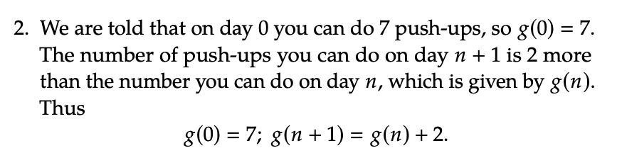

#### You can not predict the ouput of a function, if it has not been explicitly told. For example:
1. Imagine having a function where we know: 

2. We can't predict the the value of f(5) = 25, as it was not stated in the function
3. But if we state that f(n) = n^2, then it is possible to state that f(6) = 36

What you just saw is a ***closed formula***, which are explicit formulas calculating all values in the domain

**We can also define functions revursively** 
&nbsp; There is an *initial condition*, explicitly setting f(0)
 &nbsp; There is a *recurrance relation*, a formula for f((n)+1) in terms of f(n), so we need the value of f(n)

### Example: 

### Exercises:

### Solutions:

## Reference
&nbsp;[Recuursive Function Example](https://www.youtube.com/watch?v=BRJbMm4ZJDY)

Next part of the presentation by [Trostin](https://github.com/bananajoeo7/csc208/blob/main/presentations/Chapter_0.4/Chapter_0.4_Presentation_(45-48).md).