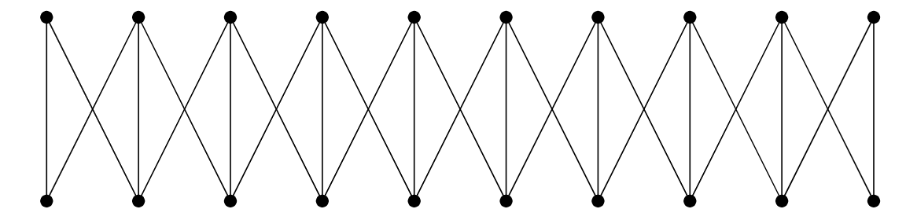
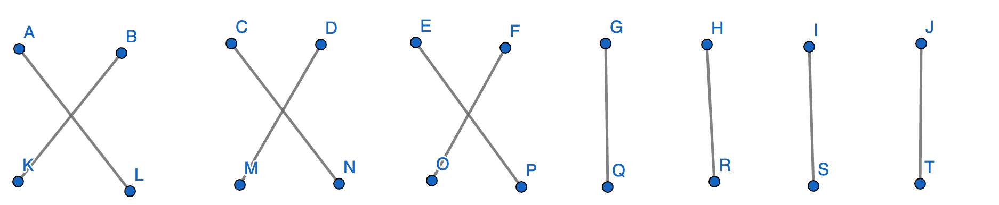
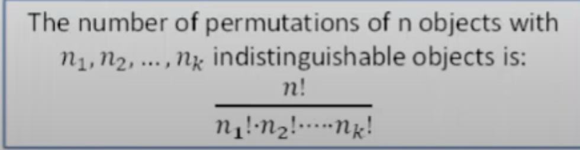

# Exercise 4
### The two richest families in Westeros have decided to enter into an alliance by marriage. The first family has 10 sons, the second has 10 girls. The ages of the kids in the two families match up. To avoid impropriety, the families insist that each child must marry someone either their own age, or someone one position younger or older. In fact, the graph representing agreeable marriages looks like this:

### The question: how many different acceptable marriage arrangements which marry off all 20 children are possible?

### A. How many marriage arrangements are possible if we insist that there are exactly 6 boys who marry girls not their own age?

### The graph above represents a possible combinatino above which fits the problem of marrying exactly 6 boys to 6 girls not their own age. In the graph above, you can see 3 X's and 4 I's. The 3 X's represents 6 boys marrying 6 grils not their own age. The 4 I's represents 4 boys marrying 4 girls that are the same age. 

### What we can do is treat the X's and I's as objects. The total number of objects is 7 (3 X's and 4 I's). Now we can use this formula for the number of combinations:

### The $n!$ on the numerator meants the factorial of the total number of objects or $7!$ The denominator would be the product of the 2 objects factorials or $4! \cdot 3!$ By doing the equation we get:

### $$ 7! \over 3! \cdot 4! $$ $$ = 35$$ 

### B. Look at smaller family sizes and get a sequence.

### This questions wants us to look at smaller family sizes! We'll do something similar to question 1 but we will trace all the possible combination of family sizes, and see if a pattern emerges. 

### C. Can you give a recurrence relation that fits the problem?

### Wait a minute! That looks like a sequence we have seen before! The Fibonacci Sequence!

### $$ a_n = a_{n-1} + a_{n-2} $$
### $$ a_1 = 1 $$
### $$ a_2 = 2 $$

