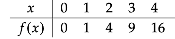

### Math Statements

 Statements are declarative statements that are either true or false:
    
    1. 1 + 1 = 2 - This is a statement
    2. His name is Jeff - Not a statement - who is "His"?
Binary Connectives:

- P ∧ Q means P and Q - Conjunction and true when both P and Q are true
- P ∨ Q means P or Q - Disjunction and true when P or Q is true
 - P ⟹ Q means if P then Q - Implication 
 - P ⟺ Q means P if and only if Q - Biconditional 

 Unary Connectives: 
  
- ¬P means not P - Negation and ¬P true when P is false

Implications: 

P ⟹ Q  
P is the Hypothesis and Q is the Conclusion

This implicatoin is true when P is False and Q is True, when P is True and Q is True, and when P is False and Q is False. ***It is only false when P is True and Q is False***

A Converse of an Implication, like P ⟹ Q is the implication Q ⟹ P 

The Contrapositive of an Implication, like P ⟹ Q is the implication ¬Q ⟹ ¬P

### Functions 

***There are 3 main ways to represent a function:***
- Equations
- Graphs
- Maps
- Tables

#### You can not predict the ouput of a function, if it has not been explicitly told. For example:
1. Imagine having a function where we know: 

](<../CH 0.4 /image.png>)

2. We can't predict the the value of f(5) = 25, as it was not stated in the function
3. But if we state that f(n) = n^2, then it is possible to state that f(6) = 36

What you just saw is a ***closed formula***, which are explicit formulas calculating all values in the domain

**We can also define functions revursively** 
&nbsp; There is an *initial condition*, explicitly setting f(0)
 &nbsp; There is a *recurrance relation*, a formula for f((n)+1) in terms of f(n), so we need the value of f(n)

### Example: 

**Surjections is where there is that the number of elements in the domain x is equal to the numebr of elements in the codomain f(x)**