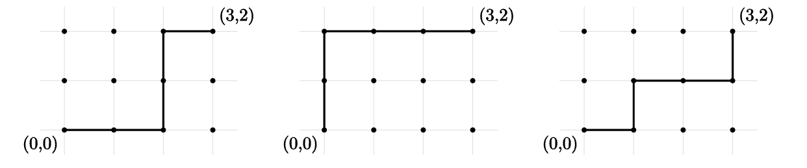
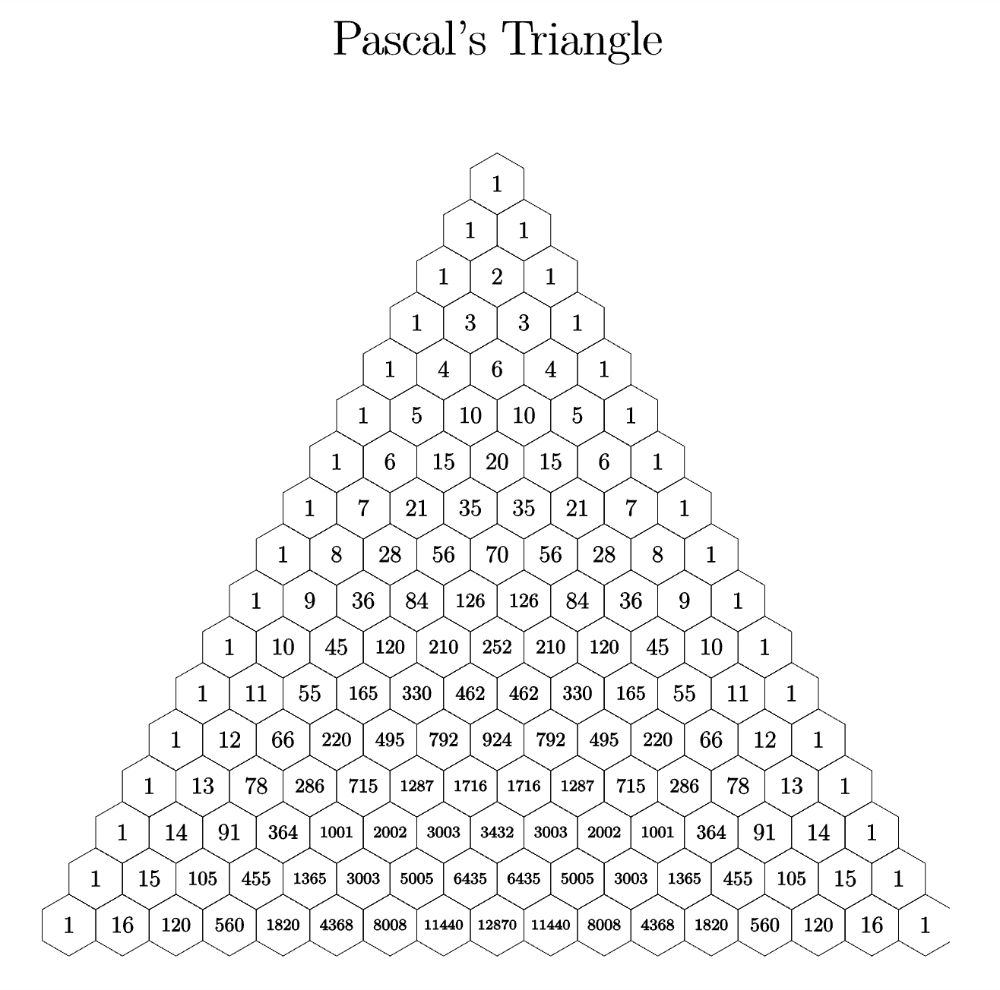

## Bits are binary digits and bit strings are strings composed of binary digits.
## Bits are 0s and 1s

## The *length* of a bit string would be the number of bits, while the *weight* would be the number of 1s.

## An *n-bitstring* is a bitstring with the length of n (containing 0s and 1s)
$B^n$ is the set of all n-bitstrings
$B^n_k$ is the set of all n-bitstrings with the weight k

### So for example, the length of 1011 would be 4 because that is the number of 0s and 1s BUT the weight would be 3 because there are 3 1s in the bitstring

## An Integer Latice is the set of all points whose (x,y) are integers. This is then displayed in a cartesian graph
## A Latice Path is the shortest path which connects two points

#### Binomial Coefficients are coefficients that are in the fully FOILED out binomial such as $(x+y)^3 =  (x+y)^3 = x^3+3x^2y^+3xy^2+y^3$
### Pascal's Triangle helps out to find the binomial coefficeints when FOILing out the binomial.

## More Binomial Coefficients 
$(^n_k) = |B^n_k|$ - The number of n-bit strings of weight k

$(^n_k)$ - The number of subsets with size n and cardinality k

$(^n_k)$ - The number of lattice paths with length n and k steps to the right

$(^n_k)$ - The coefficient of $x^ky^(n-k)$ in the expansion of $(x+y)^n$

$(^n_k)$ - The number of ways to select k objects from a total of n objects

## Recurrance Relation Formula
### Recurrance relastionships are similar to recursion in programming and is defined:
$(^n_k) = {{n-1} \choose{k-1}} + {{n-1} \choose{k}}$